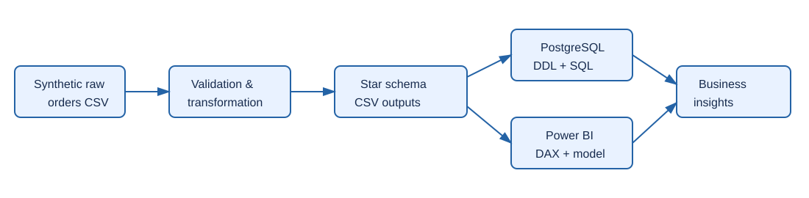

# Enterprise Sales & Revenue Intelligence

An **enterprise-style portfolio project** for exploring sales, revenue, customer, product, regional, and profitability performance. It uses deterministic **synthetic data only**—no company, customer, or commercial results are represented.



## What it implements

- Synthetic order ingestion with reproducible generation.
- Data-quality validation for schema, duplicate orders, missing data, numeric values, and discount bounds.
- A reporting-friendly star schema: `fact_sales`, `dim_date`, `dim_customer`, and `dim_product`.
- Python KPI helpers for revenue, gross profit, orders, customers, margin, and dimension-level analysis.
- PostgreSQL reference DDL plus analytical SQL using CTEs, window functions, rankings, cumulative revenue, month-over-month growth, and cohort activity.
- Power BI-ready CSV outputs and DAX measures for executive, sales, customer, product, and regional dashboards.
- Standard-library unit tests and GitHub Actions CI.

## Architecture

`Synthetic orders → validation & transformation → star-schema CSVs → PostgreSQL SQL / Power BI → business insights`

See [architecture notes](docs/architecture.md) and the [data dictionary](docs/data_dictionary.md) for operating assumptions and KPI definitions.

## Repository structure

```text
src/sales_intelligence/  Python generator, quality gates, transformations, KPI helpers
sql/                     PostgreSQL schema and analytical queries
powerbi/                 DAX measures and dashboard guidance
docs/                    Architecture, data dictionary, diagram
tests/                   Data-pipeline unit tests
data/                    Generated raw and processed CSV output locations
```

## Quick start

Requires Python 3.10+.

```bash
python -m venv .venv
source .venv/bin/activate  # Windows: .venv\\Scripts\\activate
python -m pip install -e .
PYTHONPATH=src python -m sales_intelligence.generate
PYTHONPATH=src python -m sales_intelligence.pipeline
PYTHONPATH=src python -m unittest discover -s tests -v
```

The pipeline writes CSV files to `data/processed/`. Import these into Power BI, relate `fact_sales` to its dimensions, and use [measures.dax](powerbi/measures.dax).

## SQL analytics

Run [01_schema.sql](sql/01_schema.sql) in PostgreSQL after loading the generated CSVs, then use [02_analytics.sql](sql/02_analytics.sql). The scripts cover monthly growth, customer segmentation/ranking, product profitability, running totals, and a cohort retention proxy.

## Dashboard design

- **Executive:** net revenue, gross profit, orders, customers, margin, and MoM trend.
- **Sales:** salesperson performance and average order value.
- **Customers:** segment performance, customer rankings, and cohort activity.
- **Products:** category/product revenue, margin, and cumulative contribution.
- **Regions:** regional revenue, profit, and ranking.

## Data and limitations

The data generator intentionally creates plausible but fictional records. It does not model real-world seasonality, returns, taxes, currency conversion, or slowly changing dimensions. The PostgreSQL layer is a reference schema and SQL implementation; a live database and Power BI `.pbix` file are intentionally not claimed or included.

## Quality and security

The project ships data-quality checks, unit tests, and CI. It does not require credentials. If using a database, set `DATABASE_URL` locally via `.env` and use a least-privilege account; never commit secrets.

## License

MIT. See [LICENSE](LICENSE).
